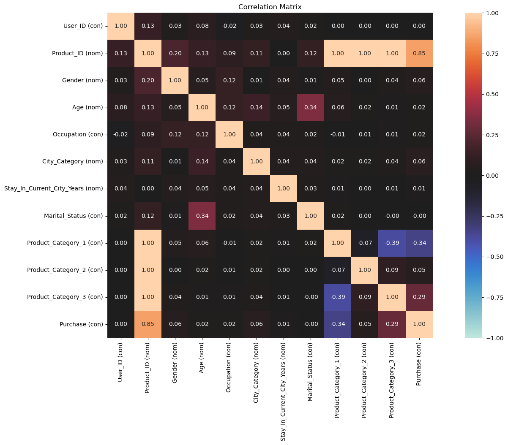
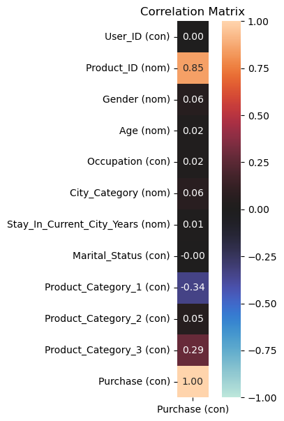
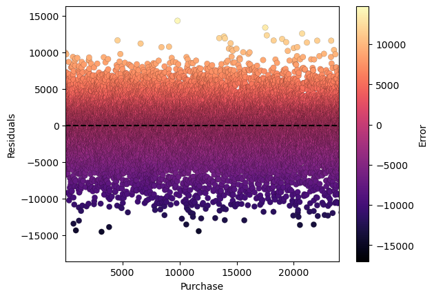
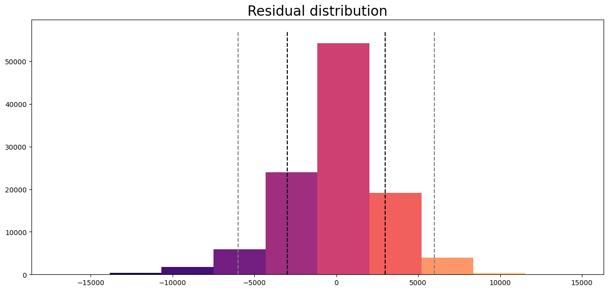

# <p align="center"> Black Friday: Purchase Prediction </p>

<p align="center"> Predicting <b>Purchase</b> amount for Black Friday data. </p>

<p align="center"> Tools used: <b>Pandas, Numpy, Matplotlib, Seaborn, Scikit-learn, Dython</p>

<p align="center">Sections:</p>

<p align="center"> 
    <a href="#Exploratory-Data-Analysis">
        Exploratory Data Analysis
    </a>
</p>

<p align="center"> 
    <a href="#Preprocessing-and-Feature-Selection">
        Preprocessing and Feature Selection
    </a>
</p>

<p align="center">
    <a href="#Model-Building-and-Evaluation">
        Model Building and Evaluation
    </a>
</p>

<p align="center">
    <a href="#Final-Prediction">
        Final Prediction
    </a>
</p>

---

# Exploratory Data Analysis

Importing the libraries and modules that we will be using:


```python
import pandas as pd
import numpy as np
import matplotlib.pyplot as plt
%matplotlib inline
import seaborn as sns
from dython import nominal # For Categorical Correlation
```

Importing the **train** and the **test** sets and taking a look at their dataframes:


```python
train_df = pd.read_csv('train.csv')
test_df = pd.read_csv('test.csv')
```


```python
print(train_df.shape)
train_df.head()
```

    (550068, 12)
    


<div>
<table border="1" class="dataframe">
  <thead>
    <tr style="text-align: right;">
      <th></th>
      <th>User_ID</th>
      <th>Product_ID</th>
      <th>Gender</th>
      <th>Age</th>
      <th>Occupation</th>
      <th>City_Category</th>
      <th>Stay_In_Current_City_Years</th>
      <th>Marital_Status</th>
      <th>Product_Category_1</th>
      <th>Product_Category_2</th>
      <th>Product_Category_3</th>
      <th>Purchase</th>
    </tr>
  </thead>
  <tbody>
    <tr>
      <th>0</th>
      <td>1000001</td>
      <td>P00069042</td>
      <td>F</td>
      <td>0-17</td>
      <td>10</td>
      <td>A</td>
      <td>2</td>
      <td>0</td>
      <td>3</td>
      <td>NaN</td>
      <td>NaN</td>
      <td>8370</td>
    </tr>
    <tr>
      <th>1</th>
      <td>1000001</td>
      <td>P00248942</td>
      <td>F</td>
      <td>0-17</td>
      <td>10</td>
      <td>A</td>
      <td>2</td>
      <td>0</td>
      <td>1</td>
      <td>6.0</td>
      <td>14.0</td>
      <td>15200</td>
    </tr>
    <tr>
      <th>2</th>
      <td>1000001</td>
      <td>P00087842</td>
      <td>F</td>
      <td>0-17</td>
      <td>10</td>
      <td>A</td>
      <td>2</td>
      <td>0</td>
      <td>12</td>
      <td>NaN</td>
      <td>NaN</td>
      <td>1422</td>
    </tr>
    <tr>
      <th>3</th>
      <td>1000001</td>
      <td>P00085442</td>
      <td>F</td>
      <td>0-17</td>
      <td>10</td>
      <td>A</td>
      <td>2</td>
      <td>0</td>
      <td>12</td>
      <td>14.0</td>
      <td>NaN</td>
      <td>1057</td>
    </tr>
    <tr>
      <th>4</th>
      <td>1000002</td>
      <td>P00285442</td>
      <td>M</td>
      <td>55+</td>
      <td>16</td>
      <td>C</td>
      <td>4+</td>
      <td>0</td>
      <td>8</td>
      <td>NaN</td>
      <td>NaN</td>
      <td>7969</td>
    </tr>
  </tbody>
</table>
</div>


```python
print(test_df.shape)
test_df.head()
```

    (233599, 11)
    


<div>
<table border="1" class="dataframe">
  <thead>
    <tr style="text-align: right;">
      <th></th>
      <th>User_ID</th>
      <th>Product_ID</th>
      <th>Gender</th>
      <th>Age</th>
      <th>Occupation</th>
      <th>City_Category</th>
      <th>Stay_In_Current_City_Years</th>
      <th>Marital_Status</th>
      <th>Product_Category_1</th>
      <th>Product_Category_2</th>
      <th>Product_Category_3</th>
    </tr>
  </thead>
  <tbody>
    <tr>
      <th>0</th>
      <td>1000004</td>
      <td>P00128942</td>
      <td>M</td>
      <td>46-50</td>
      <td>7</td>
      <td>B</td>
      <td>2</td>
      <td>1</td>
      <td>1</td>
      <td>11.0</td>
      <td>NaN</td>
    </tr>
    <tr>
      <th>1</th>
      <td>1000009</td>
      <td>P00113442</td>
      <td>M</td>
      <td>26-35</td>
      <td>17</td>
      <td>C</td>
      <td>0</td>
      <td>0</td>
      <td>3</td>
      <td>5.0</td>
      <td>NaN</td>
    </tr>
    <tr>
      <th>2</th>
      <td>1000010</td>
      <td>P00288442</td>
      <td>F</td>
      <td>36-45</td>
      <td>1</td>
      <td>B</td>
      <td>4+</td>
      <td>1</td>
      <td>5</td>
      <td>14.0</td>
      <td>NaN</td>
    </tr>
    <tr>
      <th>3</th>
      <td>1000010</td>
      <td>P00145342</td>
      <td>F</td>
      <td>36-45</td>
      <td>1</td>
      <td>B</td>
      <td>4+</td>
      <td>1</td>
      <td>4</td>
      <td>9.0</td>
      <td>NaN</td>
    </tr>
    <tr>
      <th>4</th>
      <td>1000011</td>
      <td>P00053842</td>
      <td>F</td>
      <td>26-35</td>
      <td>1</td>
      <td>C</td>
      <td>1</td>
      <td>0</td>
      <td>4</td>
      <td>5.0</td>
      <td>12.0</td>
    </tr>
  </tbody>
</table>
</div>


Looking at the **percentage of null values** for every column in the datasets:


```python
print(f'Percentage of train nulls: \n\n{(train_df.isnull().sum()/train_df.shape[0])*100}\n\n')
print(f'Percentage of test nulls: \n\n{(test_df.isnull().sum()/test_df.shape[0])*100}')
```

    Percentage of train nulls: 
    
    User_ID                        0.000000
    Product_ID                     0.000000
    Gender                         0.000000
    Age                            0.000000
    Occupation                     0.000000
    City_Category                  0.000000
    Stay_In_Current_City_Years     0.000000
    Marital_Status                 0.000000
    Product_Category_1             0.000000
    Product_Category_2            31.566643
    Product_Category_3            69.672659
    Purchase                       0.000000
    dtype: float64
    
    
    Percentage of test nulls: 
    
    User_ID                        0.000000
    Product_ID                     0.000000
    Gender                         0.000000
    Age                            0.000000
    Occupation                     0.000000
    City_Category                  0.000000
    Stay_In_Current_City_Years     0.000000
    Marital_Status                 0.000000
    Product_Category_1             0.000000
    Product_Category_2            30.969311
    Product_Category_3            69.590195
    dtype: float64
    

**Observation:** The `Product_Category_3` column has an extremely high number of nulls for both datasets. Therefore, to follow best practice, we are simply going to **remove it** later on, as trying to artificially fill it will only have a negative impact on our model's performance.

---

We are now going to define a function for visualizing the **correlations** between the columns of our datasets. I am using the **Nominal** module from **Dython** here instead of the pandas function, "df.**corr()**", as unlike pandas, nominal also includes the correlation between **categorical** variables:


```python
def cat_corr(df,columns):
    from dython import nominal
    import matplotlib.pyplot as plt
    import warnings
    
    size = ((20,10) if 'all' in columns else (5,7))
    warnings.filterwarnings("ignore")
    nominal.associations(df,figsize=size,mark_columns=True, display_columns=columns,\
                         title="Correlation Matrix")
    plt.show()
```


```python
cat_corr(train_df,'all')
```


    

    


Now we can see the correlations between all of the columns in our dataset.

But if we want to view the correlations for just one of the columns; for example, our target column, `Purchase`, we can simply view it by inputting the name of the column after the name of the dataframe, like this:


```python
cat_corr(train_df,'Purchase')
```


    

    


**Observations:** `Product_Category_1` has the highest correlation among the features, and that too negatively. Which means that: 
* **The more amount someone has bought of the product in category 1, the less the total purchase tends to be**. Something similar can be seen with `Product_Category_3`.

From the ccorrelations between all three product columns, we can also see that: 

* **The more someone has bought of one specific product, the less likely they are to buy the other products**, *except for the products in `Product_Category_2`.*

These observations could imply that the products in `Product_Category_2` may be some sort of neccessity, or very much in demand; so that spending money on other things does not make it less likely for customers to spend money on buying them as well.

The negative correlation between products 1 and 3 could imply that the people looking to buy one of them are not necessarily looking to buy the other. Maybe because the products are somewhat similar? Still, **we have to keep in mind that more than half the data on product 3 is missing! So, it might be the case they aren't negatively correlated at all**.

---

Now, let's take a deeper look at the columns and decide what we want to do with them.


```python
train_df.isnull().sum()
```


    User_ID                            0
    Product_ID                         0
    Gender                             0
    Age                                0
    Occupation                         0
    City_Category                      0
    Stay_In_Current_City_Years         0
    Marital_Status                     0
    Product_Category_1                 0
    Product_Category_2            173638
    Product_Category_3            383247
    Purchase                           0
    dtype: int64


```python
train_df.dtypes
```


    User_ID                         int64
    Product_ID                     object
    Gender                         object
    Age                            object
    Occupation                      int64
    City_Category                  object
    Stay_In_Current_City_Years     object
    Marital_Status                  int64
    Product_Category_1              int64
    Product_Category_2            float64
    Product_Category_3            float64
    Purchase                        int64
    dtype: object


```python
train_df.Marital_Status.value_counts() # Make boolean
```


    0    324731
    1    225337
    Name: Marital_Status, dtype: int64


```python
train_df.Occupation.value_counts() # Nothing
```


    4     72308
    0     69638
    7     59133
    1     47426
    17    40043
    20    33562
    12    31179
    14    27309
    2     26588
    16    25371
    6     20355
    3     17650
    10    12930
    5     12177
    15    12165
    11    11586
    19     8461
    13     7728
    18     6622
    9      6291
    8      1546
    Name: Occupation, dtype: int64


```python
train_df.Age.value_counts() # Nothing
```


    26-35    219587
    36-45    110013
    18-25     99660
    46-50     45701
    51-55     38501
    55+       21504
    0-17      15102
    Name: Age, dtype: int64


```python
train_df.Stay_In_Current_City_Years.value_counts() # Nothing
```


    1     193821
    2     101838
    3      95285
    4+     84726
    0      74398
    Name: Stay_In_Current_City_Years, dtype: int64


```python
train_df.Product_Category_2.value_counts() # Fill with either the mode or the average of 8 and 14 (11)
```


    8.0     64088
    14.0    55108
    2.0     49217
    16.0    43255
    15.0    37855
    5.0     26235
    4.0     25677
    6.0     16466
    11.0    14134
    17.0    13320
    13.0    10531
    9.0      5693
    12.0     5528
    10.0     3043
    3.0      2884
    18.0     2770
    7.0       626
    Name: Product_Category_2, dtype: int64


Now that we have decided, it is time for **processing** the data.

---

# Preprocessing and Feature Selection

We are going to define a function that will perform all the things we have decided in the previous section on the columns:


```python
def prepare(*args):
    for df in args:
        thresh = len(df)*.5
        df.dropna(thresh=thresh,axis=1,inplace=True) # Dropping columns with more than 50% null values
        df.Product_Category_2 = df.Product_Category_2.fillna(df.Product_Category_2.mode()[0]) # Filling nulls with mode
        df.Marital_Status = df.Marital_Status.astype('bool') #making column into bool
```

But first let's make a copy of our datasets:


```python
train_df_2 = train_df.copy()
test_df_2 = test_df.copy()
```

Now we will "prepare" our sets:


```python
prepare(train_df,test_df)
```

Let's check if it has worked:


```python
print(f'Data types: \n\n{train_df.dtypes}\n\n')
print(f'Null counts: \n\n{train_df.isna().sum()}')
```

    Data types: 
    
    User_ID                         int64
    Product_ID                     object
    Gender                         object
    Age                            object
    Occupation                      int64
    City_Category                  object
    Stay_In_Current_City_Years     object
    Marital_Status                   bool
    Product_Category_1              int64
    Product_Category_2            float64
    Purchase                        int64
    dtype: object
    
    
    Null counts: 
    
    User_ID                       0
    Product_ID                    0
    Gender                        0
    Age                           0
    Occupation                    0
    City_Category                 0
    Stay_In_Current_City_Years    0
    Marital_Status                0
    Product_Category_1            0
    Product_Category_2            0
    Purchase                      0
    dtype: int64
    

It has done what we wanted.

Let's take a look at the correlations now:


```python
cat_corr(train_df,'all')
```


    

    


**Observation:** The correlation of `Product_Category_2` with `Purchase` seems to have increased. This might be good news.

Now lets select the features we want to use for the model:


```python
train_df.columns
```


    Index(['User_ID', 'Product_ID', 'Gender', 'Age', 'Occupation', 'City_Category',
           'Stay_In_Current_City_Years', 'Marital_Status', 'Product_Category_1',
           'Product_Category_2', 'Purchase'],
          dtype='object')


```python
features = ['Gender', 'Age', 'Occupation', 'City_Category',
            'Stay_In_Current_City_Years', 'Marital_Status', 
            'Product_Category_1','Product_Category_2']
```

And split them into **independent** and **dependent** variables:


```python
X = pd.get_dummies(train_df[features])
y = train_df.Purchase
```

Let's have a look at them now:


```python
X.head()
```


<div>
<table border="1" class="dataframe">
  <thead>
    <tr style="text-align: right;">
      <th></th>
      <th>Occupation</th>
      <th>Marital_Status</th>
      <th>Product_Category_1</th>
      <th>Product_Category_2</th>
      <th>Gender_F</th>
      <th>Gender_M</th>
      <th>Age_0-17</th>
      <th>Age_18-25</th>
      <th>Age_26-35</th>
      <th>Age_36-45</th>
      <th>...</th>
      <th>Age_51-55</th>
      <th>Age_55+</th>
      <th>City_Category_A</th>
      <th>City_Category_B</th>
      <th>City_Category_C</th>
      <th>Stay_In_Current_City_Years_0</th>
      <th>Stay_In_Current_City_Years_1</th>
      <th>Stay_In_Current_City_Years_2</th>
      <th>Stay_In_Current_City_Years_3</th>
      <th>Stay_In_Current_City_Years_4+</th>
    </tr>
  </thead>
  <tbody>
    <tr>
      <th>0</th>
      <td>10</td>
      <td>False</td>
      <td>3</td>
      <td>8.0</td>
      <td>1</td>
      <td>0</td>
      <td>1</td>
      <td>0</td>
      <td>0</td>
      <td>0</td>
      <td>...</td>
      <td>0</td>
      <td>0</td>
      <td>1</td>
      <td>0</td>
      <td>0</td>
      <td>0</td>
      <td>0</td>
      <td>1</td>
      <td>0</td>
      <td>0</td>
    </tr>
    <tr>
      <th>1</th>
      <td>10</td>
      <td>False</td>
      <td>1</td>
      <td>6.0</td>
      <td>1</td>
      <td>0</td>
      <td>1</td>
      <td>0</td>
      <td>0</td>
      <td>0</td>
      <td>...</td>
      <td>0</td>
      <td>0</td>
      <td>1</td>
      <td>0</td>
      <td>0</td>
      <td>0</td>
      <td>0</td>
      <td>1</td>
      <td>0</td>
      <td>0</td>
    </tr>
    <tr>
      <th>2</th>
      <td>10</td>
      <td>False</td>
      <td>12</td>
      <td>8.0</td>
      <td>1</td>
      <td>0</td>
      <td>1</td>
      <td>0</td>
      <td>0</td>
      <td>0</td>
      <td>...</td>
      <td>0</td>
      <td>0</td>
      <td>1</td>
      <td>0</td>
      <td>0</td>
      <td>0</td>
      <td>0</td>
      <td>1</td>
      <td>0</td>
      <td>0</td>
    </tr>
    <tr>
      <th>3</th>
      <td>10</td>
      <td>False</td>
      <td>12</td>
      <td>14.0</td>
      <td>1</td>
      <td>0</td>
      <td>1</td>
      <td>0</td>
      <td>0</td>
      <td>0</td>
      <td>...</td>
      <td>0</td>
      <td>0</td>
      <td>1</td>
      <td>0</td>
      <td>0</td>
      <td>0</td>
      <td>0</td>
      <td>1</td>
      <td>0</td>
      <td>0</td>
    </tr>
    <tr>
      <th>4</th>
      <td>16</td>
      <td>False</td>
      <td>8</td>
      <td>8.0</td>
      <td>0</td>
      <td>1</td>
      <td>0</td>
      <td>0</td>
      <td>0</td>
      <td>0</td>
      <td>...</td>
      <td>0</td>
      <td>1</td>
      <td>0</td>
      <td>0</td>
      <td>1</td>
      <td>0</td>
      <td>0</td>
      <td>0</td>
      <td>0</td>
      <td>1</td>
    </tr>
  </tbody>
</table>
<p>5 rows × 21 columns</p>
</div>


```python
y.head()
```


    0     8370
    1    15200
    2     1422
    3     1057
    4     7969
    Name: Purchase, dtype: int64


Looks good. Time to move on to **model building**.

---

# Model Building and Evaluation

Importing **train_test_split** from scikit-learn for evalutaion:


```python
from sklearn.model_selection import train_test_split

X_train,X_test,y_train,y_test = train_test_split(X,y,test_size=0.2,random_state=1)
```

Now we are going to fit our training and test splits:


```python
from sklearn.ensemble import RandomForestRegressor
rf = RandomForestRegressor(random_state=1)

rf.fit(X_train, y_train)
```


    RandomForestRegressor(random_state=1)


```python
y_pred = rf.predict(X_test)
```

Let's write a function to score **Regression Models**. It will give us the model's **MSE**, **RMSE**, **MAE**, **MEDAE** and **MAPE**.


```python
def rf_score(test, prediction):
    from sklearn import metrics
    mse = metrics.mean_squared_error(test, prediction)
    rmse = metrics.mean_squared_error(test,prediction,squared=False)
    mae = metrics.mean_absolute_error(test, prediction)
    medae = metrics.median_absolute_error(test, prediction)
    mape = metrics.mean_absolute_percentage_error(test, prediction)

    print(f"Mean Squared Error (MSE): {mse}")
    print(f"Root Mean Squared Error (RMSE): {rmse}")
    print(f"Mean Absolute Error (MAE): {mae}")
    print(f"Median Absolute Error (MEDAE): {medae}")
    print(f"Mean Absolute Percentage Error: {mape}")
    print(f'Test variance: {np.var(y_test)}')
```

And score our model:


```python
rf_score(y_test, y_pred)
```

    Mean Squared Error (MSE): 8996639.71591952
    Root Mean Squared Error (RMSE): 2999.4399003679873
    Mean Absolute Error (MAE): 2196.7562355442087
    Median Absolute Error (MEDAE): 1628.0183837690083
    Mean Absolute Percentage Error: 0.33049550994058147
    Test variance: 25324807.738806877
    

---

Now we are going to build a model in which we input the nulls in `Product_Category_2` with the **average of the top 2 most frequent values**, instead of the **mode**. We calculated it earlier to be **11**.


```python
def prepare2(*args):
    for df in args:
        thresh = len(df)*.5
        df.dropna(thresh=thresh,axis=1,inplace=True) # Dropping columns with more than 50% null values
        df.Product_Category_2 = df.Product_Category_2.fillna(11) # Filling nulls with average
        df.Marital_Status = df.Marital_Status.astype('bool') #making column into bool
```

And apply it to the copy we created earlier:


```python
prepare2(train_df_2, test_df_2)
```

We repeat the steps for model building and evaluation:


```python
X2 = pd.get_dummies(train_df_2[features])
y2 = train_df.Purchase
```


```python
X2_train,X2_test,y2_train,y2_test = train_test_split(X2,y2,test_size=.2,random_state=1)
```


```python
rf2 = RandomForestRegressor(random_state=1)

rf2.fit(X2_train,y2_train)
```


    RandomForestRegressor(random_state=1)


```python
y2_pred = rf2.predict(X2_test)

rf_score(y2_test ,y2_pred)
```

    Mean Squared Error (MSE): 8983493.64806117
    Root Mean Squared Error (RMSE): 2997.247678798195
    Mean Absolute Error (MAE): 2195.05910380806
    Median Absolute Error (MEDAE): 1630.1461221348118
    Mean Absolute Percentage Error: 0.3301880720427081
    Test variance: 25324807.738806877
    

**Observation:** The model built on the **average** of the top 2 values is **better** than the model built on just the **mode**. So, this is the model we will use for our final predictions.


```python
residuals = y2_test - y2_pred
print(residuals.max())
print(residuals.min())
print(residuals.max() - residuals.min())
```

    14723.774297619046
    -17023.117221139968
    31746.891518759014
    

Our model's full range of error is around **31,747**.

---

Let's visualize our residuals:


```python
def plot_residual(test, prediction):
    residuals = test - prediction
    plt.scatter(np.arange(len(test)), residuals, c=residuals, cmap='magma', edgecolors='black', linewidths=.1)
    plt.colorbar(label="Error", orientation="vertical")
    plt.hlines(y = 0, xmin = 0, xmax=len(test), linestyle='--', colors='black')
    plt.xlim((test.min(), test.max()))
    plt.xlabel('Purchase'); plt.ylabel('Residuals')
    plt.show()
```


```python
plot_residual(y2_test, y2_pred)
```


    

    


```python
my_cmap = plt.get_cmap("magma")
rescale = lambda y: (y - np.min(y)) / (np.max(y) - np.min(y))
plt.rcParams["figure.figsize"] = (15,6.75)

n, bins, patches = plt.hist(residuals)
bin_centers = 0.5 * (bins[:-1] + bins[1:])
col = bin_centers - min(bin_centers)
col /= max(col)
for c, p in zip(col, patches):
    plt.setp(p, 'facecolor', my_cmap(c))
plt.vlines(x = residuals.std(), ymin = 0, ymax=57000, linestyle='--', colors='black')
plt.vlines(x = -residuals.std(), ymin = 0, ymax=57000, linestyle='--', colors='black')
plt.vlines(x = residuals.std()*2, ymin = 0, ymax=57000, linestyle='--', colors='grey')
plt.vlines(x = -residuals.std()*2, ymin = 0, ymax=57000, linestyle='--', colors='grey')
plt.title('Residual distribution', fontsize=20)
plt.show()
```


    

    


```python
print(residuals.std())
residuals.std()*2
```

    2997.2520545448024
    5994.504109089605


**Observation:** The distribution of our residuals is **normal**, so almost **70%** of our prediction results lie within just an error of around **3000**, while almost **96%** of our predictions lie within an error of around **6000**.

Now we will do our final predictions.

---


# Final Prediction

By splitting our training dataset's data into a train and test set, we have gotten a general idea on how the model might perform on real data. 

But for the final step, we will use **all** of the data in the training dataset to train the model. This way, it will have more data to train on and probably will have better predictions.


```python
rf2.fit(X2,y2)
```


    RandomForestRegressor(random_state=1)


```python
test_df_pred = rf2.predict(pd.get_dummies(test_df_2[features]))
```


```python
print(test_df_pred.shape)
test_df.shape
```

    (233599,)
    (233599, 10)


Now we are going to join our predictions as a new column in the test dataset:


```python
test_df_pred = pd.DataFrame({'Purchase': test_df_pred})
```


```python
final_df = pd.concat([test_df,test_df_pred],axis=1)
```


```python
final_df.head()
```


<div>
<table border="1" class="dataframe">
  <thead>
    <tr style="text-align: right;">
      <th></th>
      <th>User_ID</th>
      <th>Product_ID</th>
      <th>Gender</th>
      <th>Age</th>
      <th>Occupation</th>
      <th>City_Category</th>
      <th>Stay_In_Current_City_Years</th>
      <th>Marital_Status</th>
      <th>Product_Category_1</th>
      <th>Product_Category_2</th>
      <th>Purchase</th>
    </tr>
  </thead>
  <tbody>
    <tr>
      <th>0</th>
      <td>1000004</td>
      <td>P00128942</td>
      <td>M</td>
      <td>46-50</td>
      <td>7</td>
      <td>B</td>
      <td>2</td>
      <td>True</td>
      <td>1</td>
      <td>11.0</td>
      <td>18104.409213</td>
    </tr>
    <tr>
      <th>1</th>
      <td>1000009</td>
      <td>P00113442</td>
      <td>M</td>
      <td>26-35</td>
      <td>17</td>
      <td>C</td>
      <td>0</td>
      <td>False</td>
      <td>3</td>
      <td>5.0</td>
      <td>10501.056810</td>
    </tr>
    <tr>
      <th>2</th>
      <td>1000010</td>
      <td>P00288442</td>
      <td>F</td>
      <td>36-45</td>
      <td>1</td>
      <td>B</td>
      <td>4+</td>
      <td>True</td>
      <td>5</td>
      <td>14.0</td>
      <td>8246.751493</td>
    </tr>
    <tr>
      <th>3</th>
      <td>1000010</td>
      <td>P00145342</td>
      <td>F</td>
      <td>36-45</td>
      <td>1</td>
      <td>B</td>
      <td>4+</td>
      <td>True</td>
      <td>4</td>
      <td>9.0</td>
      <td>2447.156333</td>
    </tr>
    <tr>
      <th>4</th>
      <td>1000011</td>
      <td>P00053842</td>
      <td>F</td>
      <td>26-35</td>
      <td>1</td>
      <td>C</td>
      <td>1</td>
      <td>False</td>
      <td>4</td>
      <td>5.0</td>
      <td>1808.537429</td>
    </tr>
  </tbody>
</table>
</div>


We can now export the results as a csv, and we are done.

---
